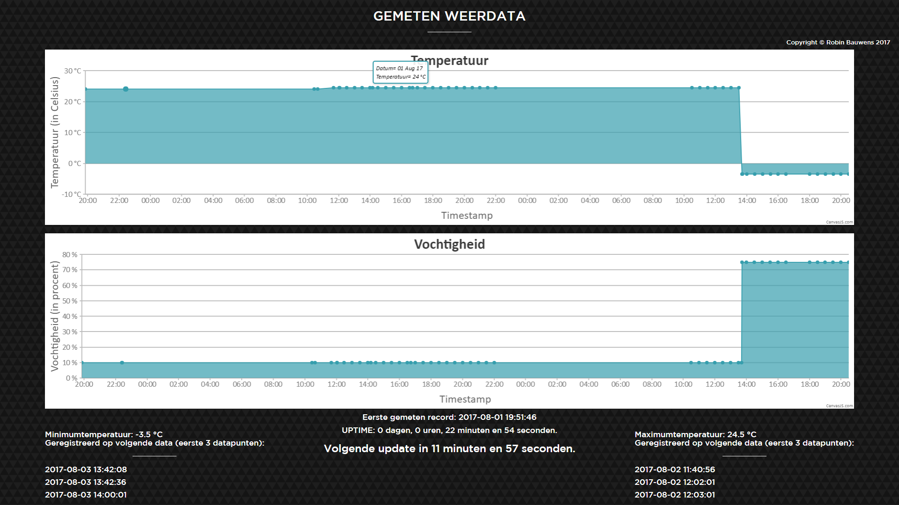
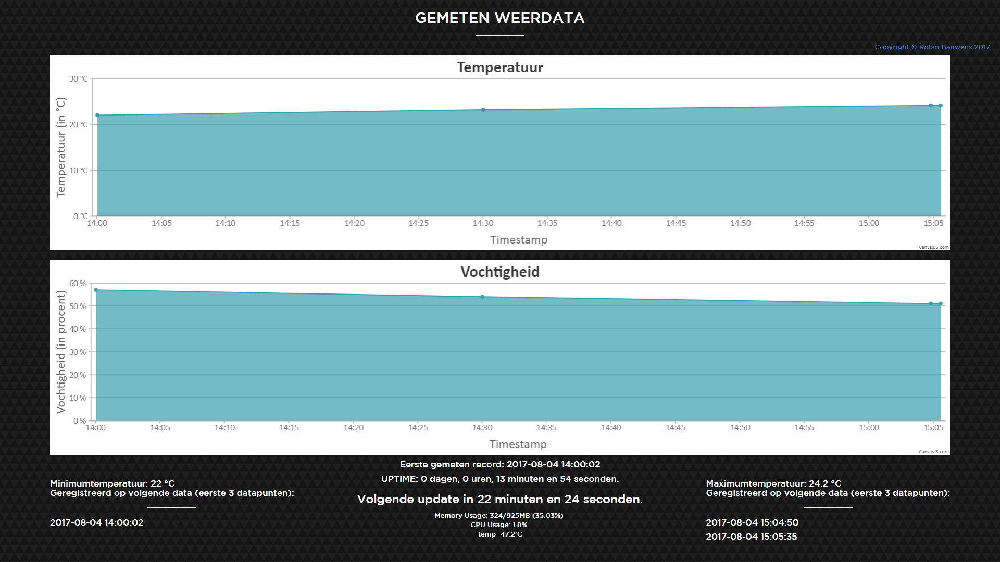
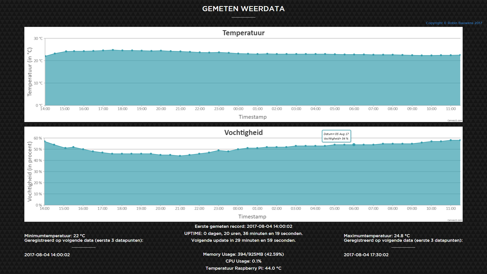
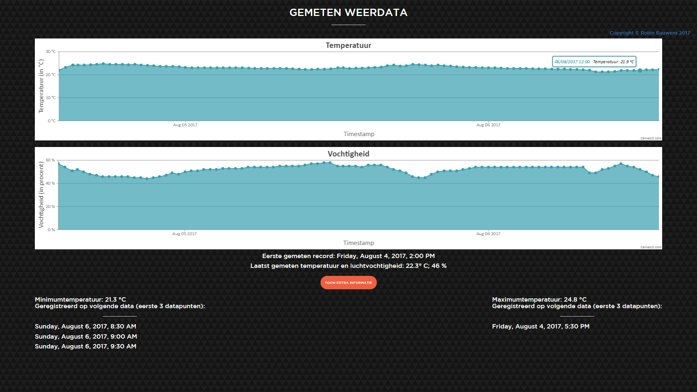
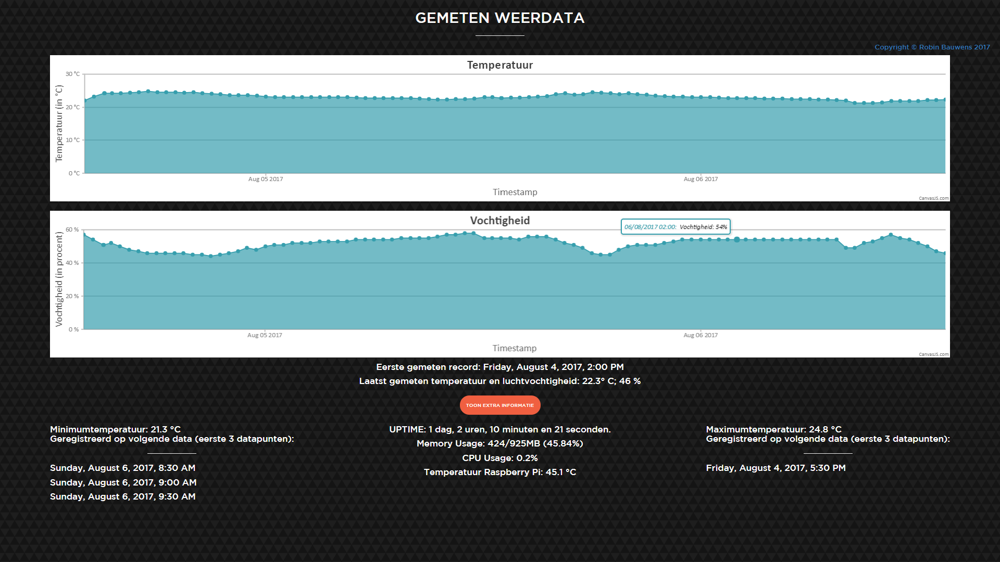

## Project: verzamelen weerdata (temperatuur, luchtvochtigheid, etc.).

- [Project met MySQL-databank](https://www.raspberryweather.com/python-script/)
- [Webserver met MySQL-databank](http://raspberrywebserver.com/sql-databases/using-mysql-on-a-raspberry-pi.html)
- [Met Weather Underground-website](https://computertotaal.nl/artikelen/overige-elektronica/raspberry-pi-2-als-weerstation-66473/?article-page=1)

[Tutorial: verbinden RP met sensor + scherm](https://www.youtube.com/watch?v=aEnS0-Jy2vE)

[Geschreven handleiding: uitleg bovenstaande tutorial](http://www.circuitbasics.com/raspberry-pi-ds18b20-temperature-sensor-tutorial/)

## Benodigdheden DS18B20: temperatuur

- [Raspberry Pi 3 model B (of andere versie met GPIO-pinnen](https://www.sossolutions.nl/raspberry-pi-3b?gclid=EAIaIQobChMIxdKmvI671QIVQ54bCh315gqsEAAYASAAEgKF0vD_BwE)
- [DS18B20](https://www.sossolutions.nl/374-ds18b20-digital-temperature-sensor-extras)
- [Breadboard](https://www.sossolutions.nl/half-size-breadboard)
- [Micro SD-kaart 16GB](https://www.sossolutions.nl/16gb-sandisk-ultra-micro-sdhc-80mb-s)
- [Female/Female jumperwires](https://www.sossolutions.nl/premium-female-female-jumper-wires-40-x-6)
- Voeding

## Benodigdheden AM2302: temperatuur & luchtvochtigheid

- [Raspberry Pi 3 model B (of andere versie met GPIO-pinnen](https://www.sossolutions.nl/raspberry-pi-3b?gclid=EAIaIQobChMIxdKmvI671QIVQ54bCh315gqsEAAYASAAEgKF0vD_BwE)
- [AM2302](https://www.sossolutions.nl/393-am2302-wired-dht22-temperature-humidity-sensor)
- [Micro SD-kaart 16GB](https://www.sossolutions.nl/16gb-sandisk-ultra-micro-sdhc-80mb-s)
- [Female/Female jumperwires](https://www.sossolutions.nl/premium-female-female-jumper-wires-40-x-6)
- Voeding

<!--## TODO / Op te letten

/- Parse string (?) naar int in javascript om te tonen op grafiek.
/- Omzetten van int naar float/double in javascript + MySQL, ...
- Pas op met parseren; ook opletten voor 10,20,30,etc. (De getekende lijn kan soms "onder" de lijnen van de y-as liggen) 
- Correctie: lijnen liggen niet per se onder andere lijnen, probleem was: parseren naar int...

**Maak ook een crontab via `crontab -e`:**

`TZ="Europe/Brussels"`

`0,30 * * * * /usr/bin/python /home/pi/mysqltest.py`
-->

- Naamgeving `mysqltest.py` aanpassen.
<!--- Toevoegen foto's.
 - Scheiden JS en PHP + lay-out CSS -->

### Werking

Dit project werkt gemaakt om de temperatuur (en luchtvochtigheid) te meten a.d.h.v. sensoren (DS18B20 & AM2302). De gemeten waarden worden opgevraagd via `mysqltest.py`. Dit script zal ook een MySQL-database `WeatherStation` met tabel `WeatherData` aanmaken indien deze nog niet bestaat (zie bestand `createTable.sql`). Vervolgens zal het script de tabel aanvullen (kolommen `ID`, `Temperature` (float met 1 cijfer na de komma), `Humidity` (int voor percentage), `Timestamp`).

Via een `crontab`-entry zal het script automatisch om de 30 minuten aangeroepen worden.

In `/var/www/html/` (Apache) zal je de `index.php` vinden (bij mij `http://192.168.0.110/index.php`; indien er in je `html`-directory geen andere index-bestanden zitten kan je ook `http://192.168.0.110` gebruiken). Indien je dit bestand opent in je browser dan zal er verbinding gemaakt worden met de databank en een `weatherdata.json`-bestand aangemaakt worden in `/var/www/html/`. Het PHP-bestand bevat ook een referentie naar een HTML-bestand die wat JavaScript-code aanroept (incl. jQuery en CanvasJS) om de 2 canvassen aan te maken met daarin eenerzijds de gemeten temperatuur + timestamp en anderzijds de gemeten luchtvochtigheid + timestamp. Verder zorgt de CSS voor de extra opmaak van de webpagina.

### Werking TL;DR

Sensors -> Python -> MySQL -> PHP -> Data (JSON) -> HTML & JS ->  kewl graphs

DB (MySQL) werd gebruikt om LAMP-stack te simuleren.

### Demo

